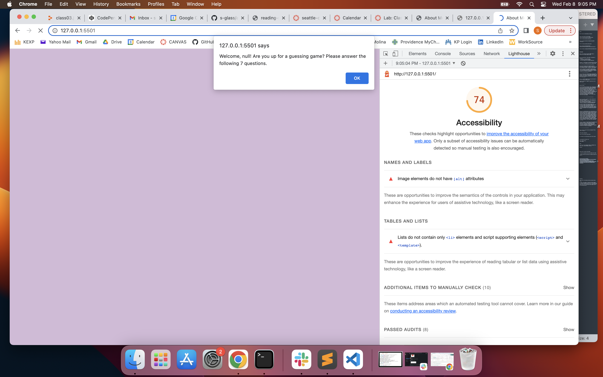

# About Me

In this About Me repository, I'll be adding information about myself to complete Code 201 Lab 02, 03 (and more).

## Author: Sarah Glass

## Lab 02
Create an About Me page with"
- short bio, education and job history, and goals
- 5 yes/no user prompts taking into consideration case sensitivity
- ask user for name and welcome them with their name

## Lab 03
- Adding in a "Top Ten" as an ordered HTML list.
- Adding a 6th question that allows user 4 attempts to guess a number, alerts 'too high' or 'too low', and gives the correct answer at the end.
- Adding a 7th question with multiple correct answers, stored in an array. User has 6 attempts, and ends when correctly answered or no more attempts left. All correct answers displayed to the user, 
- Track and display correct number of answers out of the 7 questions.

## Lab 04
Added functions to JS - worked on together:
- Driver: Logan Reese
- Navigator: Sarah Glass

## Links and Resources

## Most Recent Lighthouse accessibility score (insert screenshot)

## Reflections and Comments

### Lab 02: 

For this assignment, I relied heavily on notes from today's class and from my own code from previous assignments. One reflection piece is that I'm super excited I was able to make the site work properly without TA help (knock on wood...famous last words).

* I'm happy with how this Lab went, overall. It went a lot faster than I was anticipating and I didn't miss any semicolons or typos this time (which usually takes me forever to find).

* No questions for now - I'm happy to take things slowly and one step at a time. Something I learned is that if your terminal isn't in the correct repository, it won't show changes to another repository using git status until you move to the correct one.

* It took me about an hour and fifteen minutes. I thought it would take me at least a few hours. Far and away the CSS styling took the longest.

-----------------------------

### Lab 03:

* This lab was tough! I needed a lot of TA support, spent a lot of time searching Google results and class notes and even rewatching class demos to get through it. Part of what contributed to the difficulty for me was just having a poor night's sleep the previous night, which makes it so much harder for my brain to work.

* A few observations: a) Now that we have the reset.css doc in this repo, I had to go back in and style even the types of bullets and numbers in lists; b) there are lots of ways to complete a given task, and I somehow always seem to find the hardest way! I'm grateful for TA patience with me on this lab.

* It took me in total about 5.5 hours to complete this assignment. I had no idea how long it would take me, but I didn't expect it to take quite that long. 