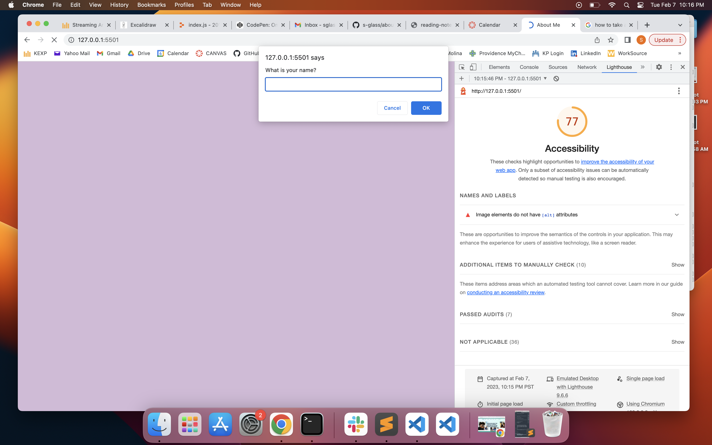

# About Me

In this About Me repository, I'll be adding information about myself to complete Code 201 Lab 02 (and more).

## Author: Sarah Glass

## Code 201 - Lab 02

## Links and Resources

## Lighthouse accessibility score (insert screenshot)

## Reflections and Comments

For this assignment, I relied heavily on notes from today's class and from my own code from previous assignments. One reflection piece is that I'm super excited I was able to make the site work properly without TA help (knock on wood...famous last words).

* I'm happy with how this Lab went, overall. It went a lot faster than I was anticipating and I didn't miss any semicolons or typos this time (which usually takes me forever to find).

* No questions for now - I'm happy to take things slowly and one step at a time. Something I learned is that if your terminal isn't in the correct repository, it won't show changes to another repository using git status until you move to the correct one.

* It took me about an hour and fifteen minutes. I thought it would take me at least a few hours. Far and away the CSS styling took the longest.